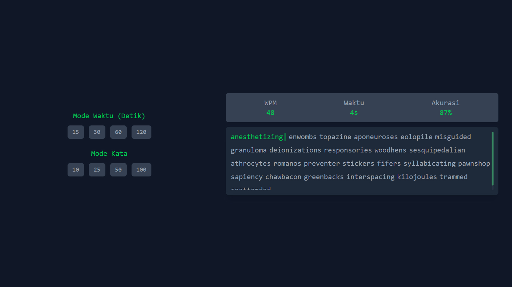

# Type Lynx

Sebuah aplikasi tes mengetik minimalis dan berkinerja tinggi yang dibuat dengan tumpukan teknologi web modern. Terinspirasi oleh *Monkeytype*.



Type Lynx adalah aplikasi tes kecepatan mengetik yang dibuat dari awal untuk meniru nuansa bersih dan fungsionalitas inti dari game mengetik populer. Proyek ini dibangun sebagai latihan untuk mengimplementasikan logika permainan yang interaktif (termasuk *state management*, *timer*, dan kalkulasi WPM) dengan *tech stack* modern.

---

## ✨ Fitur Utama

* **Kalkulasi Real-time:** WPM (Words Per Minute) dan Akurasi diperbarui secara *real-time* setelah setiap ketukan.
* **Dua Mode Permainan:**
    * **Mode Waktu:** Selesaikan kata sebanyak mungkin dalam waktu tertentu (misal: 15, 30, 60 detik).
    * **Mode Kata:** Selesaikan jumlah kata yang ditentukan (misal: 10, 25, 50 kata).
* **Validasi Interaktif:** Umpan balik visual per karakter (huruf benar/salah) dengan kursor (caret) yang berkedip.
* **Keyboard Support:** Penanganan keyboard penuh, termasuk tombol `Backspace` untuk koreksi.
* **Auto-Scroll:** Di Mode Waktu, "jendela kata" akan otomatis *scroll* ke atas saat kamu pindah baris, menjaga timer dan WPM tetap terlihat.
* **Dinamis:** Mengambil daftar kata acak dari API eksternal setiap kali tes baru dimulai.

---

## 🛠️ Tumpukan Teknologi (Tech Stack)

Proyek ini dibangun menggunakan kombinasi teknologi yang berfokus pada kecepatan dan pengalaman *developer*:

* **Bun:** Berfungsi sebagai *runtime*, *bundler*, dan *package manager* super cepat.
* **Vite:** Menyediakan *development server* yang menyala instan (`HMR`).
* **React (TypeScript):** Untuk membangun UI yang interaktif dan *type-safe*.
* **TailwindCSS:** Untuk *utility-first styling* yang cepat dan modern.

---

## 🚀 Memulai (Getting Started)

Untuk menjalankan proyek ini secara lokal di komputermu:

1.  **Clone repositori ini:**
    ```bash
    git clone [URL-REPOSITORI-KAMU]
    cd type-lynx
    ```

2.  **Install semua *dependencies***:
    (Pastikan kamu sudah meng-install [Bun](https://bun.sh/))
    ```bash
    bun install
    ```

3.  **Jalankan *development server***:
    ```bash
    bun run dev
    ```

4.  **Buka di browser:**
    Buka `http://localhost:5173` (atau port apa pun yang ditampilkan di terminalmu).

---